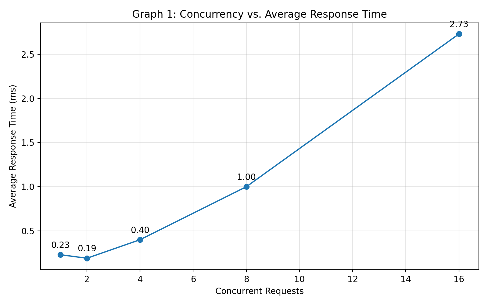
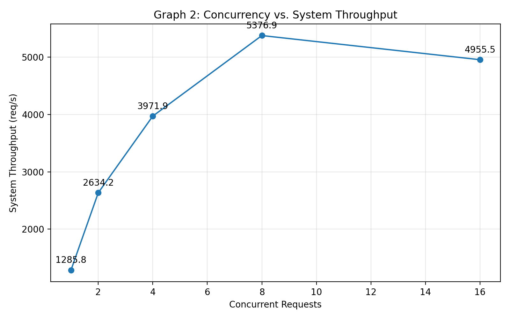
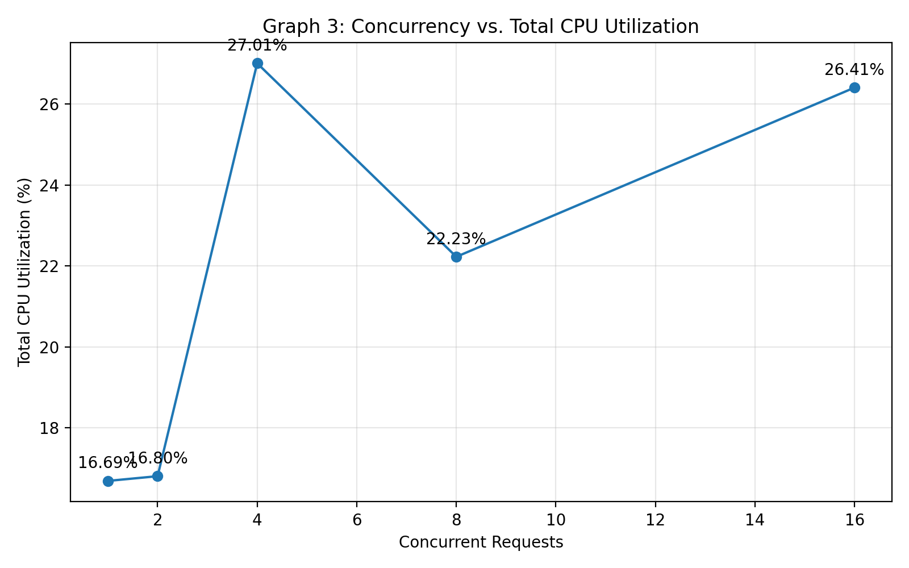
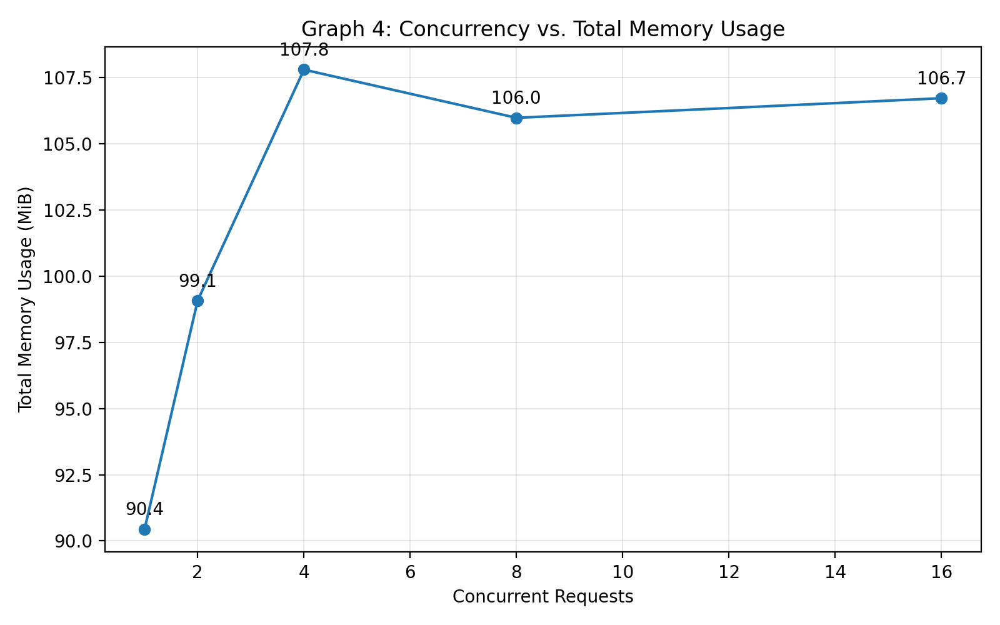
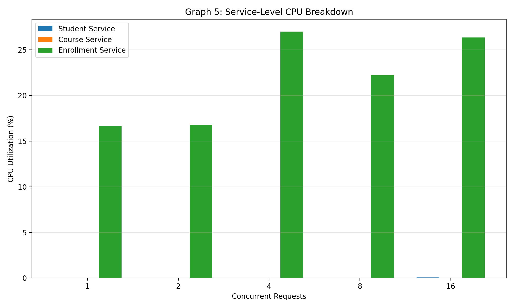
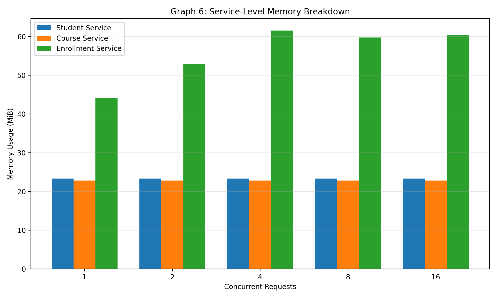

# Student Management System — Containerized Microservices & Workload Evaluation

**Docker Compose • Node.js • Express • Python • Matplotlib • Autocannon**

**Course:** Cloud Computing Lab (Evaluation 1)  
**System Domain:** Student Management & Course Enrollment System

---

## 1. System Architecture & Inter-Service Topology

The system is implemented as three independently containerized Node.js microservices communicating over an isolated Docker user-defined bridge network.

The **enrollment-service** acts as the orchestrator. It validates a student through the student-service, validates a course through the course-service, and returns an aggregated enrollment response.

```text
                         +-------------------------+
                         |     Client / Load Test  |
                         +-------------------------+
                                    |
                                    | HTTP
                                    v
              ============== [ microservice-network ] ==============
              |                                                     |
              |             +---------------------------+           |
              |             |    enrollment-service     |           |
              |             |       Port 3003           |           |
              |             |       Orchestrator        |           |
              |             +---------------------------+           |
              |                    |             |                  |
              | HTTP GET /students |             | HTTP GET /courses|
              |                    v             v                  |
              |        +----------------+   +----------------+      |
              |        | student-service|   | course-service |      |
              |        |    Port 3001   |   |    Port 3002   |      |
              |        +----------------+   +----------------+      |
              |                                                     |
              =======================================================
```

### Request flow

For a complete enrollment request:

```text
Client
  |
  | POST /enroll
  v
Enrollment Service
  |
  +---- GET /students/:id ----> Student Service
  |
  +---- GET /courses/:id -----> Course Service
  |
  v
Aggregated Enrollment Response
```

This demonstrates synchronous inter-service communication across the Docker network.

---

## 2. Microservice Directory Structure

```text
microservice-lab/
├── .gitignore
├── docker-compose.yml
├── README.md
│
├── student-service/
│   ├── server.js
│   ├── Dockerfile
│   ├── package.json
│   └── package-lock.json
│
├── course-service/
│   ├── server.js
│   ├── Dockerfile
│   ├── package.json
│   └── package-lock.json
│
├── enrollment-service/
│   ├── server.js
│   ├── Dockerfile
│   ├── package.json
│   └── package-lock.json
│
├── load-test/
│   ├── monitor.py
│   └── make_graphs.py
│
└── results/
    ├── raw/
    │   ├── w1_stats.csv
    │   ├── w2_stats.csv
    │   ├── w4_stats.csv
    │   ├── w8_stats.csv
    │   └── w16_stats.csv
    │
    ├── resource_analysis.csv
    ├── graph1_response_time.png
    ├── graph2_throughput.png
    ├── graph3_total_cpu.png
    ├── graph4_total_memory.png
    ├── graph5_service_cpu.png
    └── graph6_service_memory.png
```

---

## 3. Microservice Specifications

### 3.1 student-service — Port 3001

**Role:** Maintains the in-memory student catalog.

### Endpoints

| Method | Endpoint | Description |
|---|---|---|
| GET | `/students` | Returns all students |
| GET | `/students/:id` | Returns a specific student |
| POST | `/students` | Creates a new student |
| GET | `/health` | Health check |

### Sample student

```json
{
  "id": 1,
  "name": "Ankush",
  "department": "CS-AI",
  "email": "ankush@example.com"
}
```

---

### 3.2 course-service — Port 3002

**Role:** Maintains the in-memory course catalog.

### Endpoints

| Method | Endpoint | Description |
|---|---|---|
| GET | `/courses` | Returns all courses |
| GET | `/courses/:id` | Returns a specific course |
| POST | `/courses` | Creates a new course |
| GET | `/health` | Health check |

### Sample course

```json
{
  "id": 101,
  "name": "Machine Learning",
  "credits": 4,
  "code": "CS401"
}
```

---

### 3.3 enrollment-service — Port 3003

**Role:** Orchestrates student and course validation before creating an enrollment.

### Endpoints

| Method | Endpoint | Description |
|---|---|---|
| POST | `/enroll` | Creates an enrollment using both dependent services |
| GET | `/enrollments` | Returns all enrollments |
| GET | `/enrollments/:id` | Returns a specific enrollment |
| GET | `/health` | Health check |

The orchestration request uses:

```text
http://student-service:3001/students/:id
http://course-service:3002/courses/:id
```

The service names resolve through the Docker Compose network.

---

# 4. Quickstart & Deployment

## Prerequisites

- Docker Desktop
- Docker Compose v2+
- Node.js 20+
- Python 3.10+
- npm / npx

## Step 1: Clone the repository

```bash
git clone https://github.com/Ankush-learning/cc-lab-eval-1.git
cd cc-lab-eval-1
```

## Step 2: Build and launch all services

```bash
docker compose up --build -d
```

## Step 3: Verify containers

```bash
docker compose ps
```

Expected services:

```text
student-service
course-service
enrollment-service
```

All three services expose their ports to the host:

```text
3001 → student-service
3002 → course-service
3003 → enrollment-service
```

---

# 5. API Verification

## Test 1 — Student Service

```powershell
Invoke-RestMethod http://localhost:3001/students/1
```

Expected response:

```json
{
  "id": 1,
  "name": "Ankush",
  "department": "CS-AI",
  "email": "ankush@example.com"
}
```

## Test 2 — Course Service

```powershell
Invoke-RestMethod http://localhost:3002/courses/101
```

Expected response:

```json
{
  "id": 101,
  "name": "Machine Learning",
  "credits": 4,
  "code": "CS401"
}
```

## Test 3 — Enrollment Service

```powershell
Invoke-RestMethod http://localhost:3003/enrollments
```

Returns the current enrollment collection.

## Test 4 — Complete Inter-Service Request

```powershell
Invoke-RestMethod `
  -Method POST `
  -Uri http://localhost:3003/enroll `
  -ContentType "application/json" `
  -Body '{"studentId":1,"courseId":101}'
```

This request demonstrates the complete microservice flow:

```text
Client
  ↓
Enrollment Service
  ↓
Student Service
  ↓
Course Service
  ↓
Enrollment Response
```

A successful response contains the validated student, validated course, and enrollment status.

---

# 6. Workload Testing & Telemetry Collection

The system was evaluated using five concurrency levels:

```text
1
2
4
8
16
```

Each workload was executed for **10 seconds** using Autocannon.

### Load-test commands

```powershell
npx autocannon -c 1 -d 10 http://localhost:3003/enrollments
npx autocannon -c 2 -d 10 http://localhost:3003/enrollments
npx autocannon -c 4 -d 10 http://localhost:3003/enrollments
npx autocannon -c 8 -d 10 http://localhost:3003/enrollments
npx autocannon -c 16 -d 10 http://localhost:3003/enrollments
```

### Resource monitoring

Docker CPU and memory statistics were sampled continuously during each workload using:

```text
docker stats --no-stream
```

The Python monitoring script stores raw samples in:

```text
results/raw/
```

with one file for each concurrency level.

---

# 7. Evaluation Observation Table

The final Autocannon measurements were:

| Concurrency | Avg Response Time (ms) | Throughput (req/s) | Max Latency (ms) | Failed Requests |
|---:|---:|---:|---:|---:|
| 1 | 0.23 | 1285.8 | 26 | 0 |
| 2 | 0.19 | 2634.2 | 17 | 0 |
| 4 | 0.40 | 3971.9 | 34 | 0 |
| 8 | 1.00 | 5376.91 | 17 | 0 |
| 16 | 2.73 | 4955.5 | 94 | 0 |

### Key observations

1. Response time remained very low at low concurrency and increased to 2.73 ms at 16 concurrent connections.
2. Throughput increased substantially from 1 to 8 concurrent connections.
3. Peak measured throughput was **5376.91 req/s at concurrency 8**.
4. Throughput decreased slightly at concurrency 16, indicating the beginning of saturation under the tested workload.
5. No failed requests were recorded in the final clean benchmark runs.
6. The maximum observed latency was **94 ms at concurrency 16**.

---

# 8. Performance Visualization

Six graphs are generated from the measured benchmark and Docker telemetry data.

Generate the graphs with:

```powershell
python load-test/make_graphs.py
```

## Graph 1: Concurrency vs. Average Response Time

Shows how average request latency changes as the number of concurrent connections increases.



## Graph 2: Concurrency vs. System Throughput

Shows the number of requests processed per second at each concurrency level.



## Graph 3: Concurrency vs. Total CPU Utilization (%)

Shows the combined CPU utilization of:

```text
student-service
course-service
enrollment-service
```

for each workload.



## Graph 4: Concurrency vs. Total Memory Usage (MiB)

Shows the combined memory footprint of all three microservices as concurrency changes.



## Graph 5: Service-Level CPU Breakdown

Compares CPU utilization among:

```text
student-service
course-service
enrollment-service
```

at each concurrency level.



## Graph 6: Service-Level Memory Breakdown

Compares memory usage among the three microservices at each concurrency level.



# 9. Resource Analysis

The processed resource dataset is stored in:

```text
results/resource_analysis.csv
```

The raw telemetry is retained separately in:

```text
results/raw/
```

This allows the graphs and calculated averages to be reproduced without manually entering resource values.

### Important measurement note

CPU and memory values are calculated from the Docker statistics sampled during each workload window. They are therefore telemetry measurements of the running containers rather than manually estimated values.

---

# 10. Technical Analysis Highlights

### Throughput behavior

The system scales strongly from 1 through 8 concurrent connections:

```text
1285.8 req/s
       ↓
2634.2 req/s
       ↓
3971.9 req/s
       ↓
5376.91 req/s
```

At 16 concurrent connections, throughput falls to:

```text
4955.5 req/s
```

while average latency rises to:

```text
2.73 ms
```

This indicates that the tested configuration is approaching a saturation point around the higher concurrency levels.

### Service-level behavior

The enrollment-service performs the orchestration work and communicates with both downstream services. Consequently, it is the primary service involved in the end-to-end enrollment workflow.

The student-service and course-service primarily perform in-memory lookups and return JSON responses, while the enrollment-service performs additional request handling, downstream HTTP calls, response processing, and aggregation.

---

# 11. Technology Stack

### Microservices

- Node.js 20
- Express.js
- REST APIs

### Containerization

- Docker
- Docker Compose
- User-defined bridge network

### Load Testing

- Autocannon
- Concurrent workload levels: 1, 2, 4, 8, 16

### Telemetry & Visualization

- Python 3.10+
- Docker Stats
- Matplotlib
- CSV-based analysis

---

# 12. Cleanup

To stop and remove the containers and network:

```powershell
docker compose down
```

To additionally remove associated volumes:

```powershell
docker compose down -v
```

To rebuild from scratch:

```powershell
docker compose down
docker compose build --no-cache
docker compose up -d
```

---

## Cloud Computing Lab — Evaluation 1

**Project:** Student Management System using Microservices  
**Architecture:** 3 independently containerized REST microservices  
**Orchestration:** Enrollment Service  
**Network:** Docker user-defined bridge network  
**Workloads:** 1, 2, 4, 8, 16 concurrent requests  
**Graphs:** 6  
**Load Test Duration:** 10 seconds per workload
