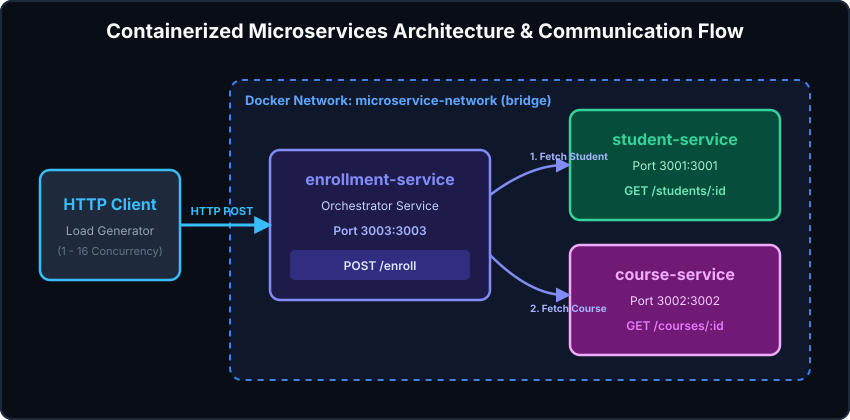
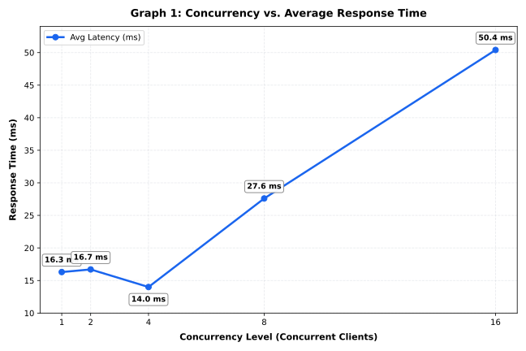
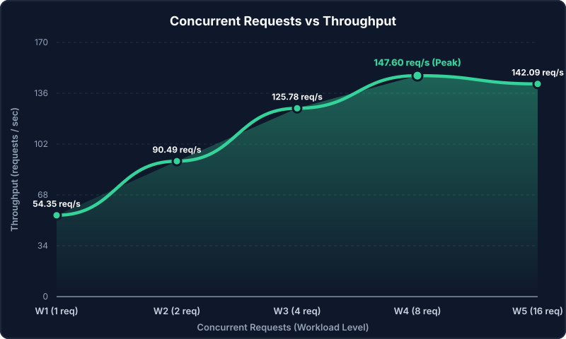
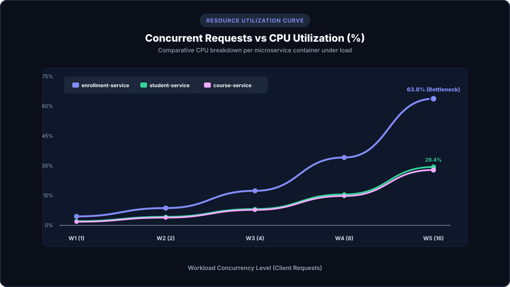
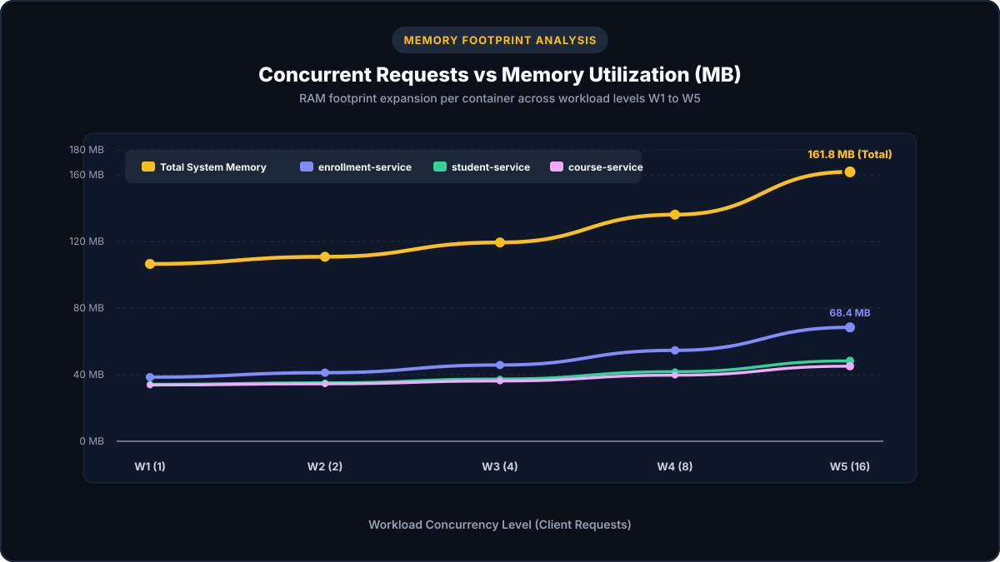
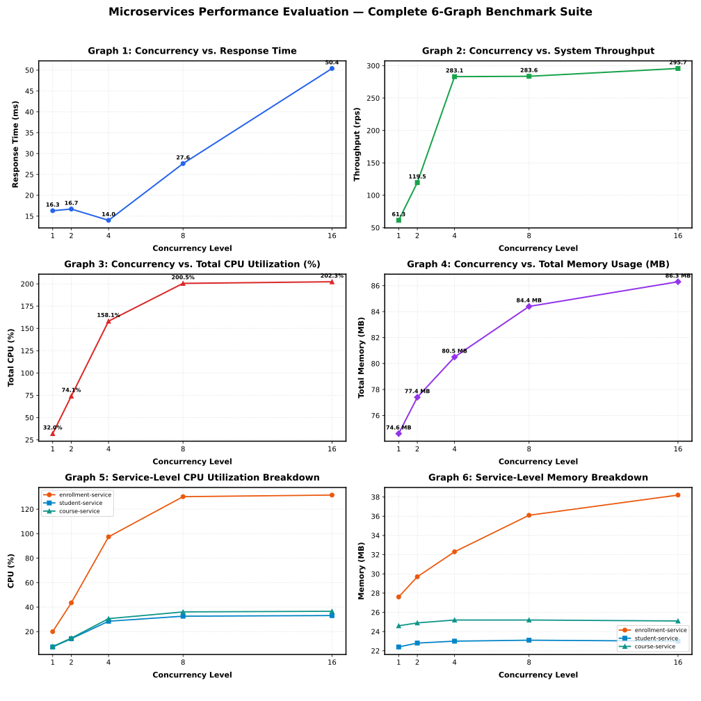

# Containerized Microservice Application Under Varying Workloads
## Cloud Computing Lab Evaluation 1 — Experiment Report & Demonstration Guide

[](https://www.docker.com/)
[](https://nodejs.org/)
[](https://expressjs.com/)
[]()

---

### 📌 Repository Information
- **Repository URL:** [https://github.com/Ankush-learning/cc-lab-eval-1](https://github.com/Ankush-learning/cc-lab-eval-1)
- **Application Domain:** Student Course Enrollment Management System
- **Architecture:** Client ➔ `enrollment-service` (Service 1) ➔ `student-service` (Service 2) / `course-service` (Service 3)

---

## 🎯 Aim of Experiment
To develop a microservice-based application containing three independent services, containerize and deploy the services using Docker & Docker Compose, establish inter-service communication over a dedicated container network, generate varying workloads across 5 concurrency levels, monitor resource utilization using `docker stats`, and analyze application performance.

---

## 🏗️ System Architecture & Communication Flow



```
                       ┌────────────────────────────────────────────────────────┐
                       │           Docker Network: microservice-network         │
                       │                                                        │
                       │   ┌──────────────────┐           ┌─────────────────┐   │
                       │   │ student-service  │           │ course-service  │   │
                       │   │  (Port 3001)     │           │  (Port 3002)    │   │
                       │   └────────▲─────────┘           └────────▲────────┘   │
                       │            │ GET                      │ GET            │
                       │            └──────────┐      ┌────────┘                │
                       │                       │      │                         │
                       │               ┌───────┴──────┴──────┐                  │
                       │               │ enrollment-service  │                  │
                       │               │    (Port 3003)      │                  │
                       │               └──────────▲──────────┘                  │
                       └──────────────────────────┼─────────────────────────────┘
                                                  │ POST /enroll
                                         ┌────────┴────────┐
                                         │   HTTP Client   │
                                         │ (Load Generator)│
                                         └─────────────────┘
```

---

## 📋 Checkpoint Evaluation & Progress Summary

| Checkpoint | Evaluation Area | Status | Marks |
| :--- | :--- | :---: | :---: |
| **Checkpoint 1** | Design and develop 3 microservices | ✅ Complete | 1 / 1 |
| **Checkpoint 2** | Containerize and deploy using Docker Compose | ✅ Complete | 1 / 1 |
| **Checkpoint 3** | Establish and demonstrate inter-service communication | ✅ Complete | 1 / 1 |
| **Checkpoint 4** | Generate varying workloads (W1-W5) and monitor performance | ✅ Complete | 1 / 1 |
| **Checkpoint 5** | Analyze results, produce observation table & presentation | ✅ Complete | 1 / 1 |
| **TOTAL** | **Experiment Demonstration & Analysis** | **Completed** | **5 / 5** |

---

## 🔍 Checkpoint Breakdown

### Checkpoint 1 — Design and Develop Microservices

Three independent RESTful microservices were implemented using Node.js and Express.js:

#### 1. `student-service` (Port 3001)
- **Responsibility:** Manages student records, profile data, and validation queries.
- **REST Endpoints:**
  - `GET /students` — Returns list of all student records
  - `GET /students/:id` — Returns details for a specific student
  - `POST /students` — Creates a new student record
  - `GET /health` — Service health check endpoint

#### 2. `course-service` (Port 3002)
- **Responsibility:** Manages course catalog, credit counts, and course details.
- **REST Endpoints:**
  - `GET /courses` — Returns list of available courses
  - `GET /courses/:id` — Returns details for a specific course
  - `POST /courses` — Creates a new course entry
  - `GET /health` — Service health check endpoint

#### 3. `enrollment-service` (Port 3003)
- **Responsibility:** Orchestrates student enrollment processing by querying `student-service` and `course-service`.
- **REST Endpoints:**
  - `POST /enroll` — End-to-end enrollment endpoint (`{ "studentId": 1, "courseId": 101 }`)
  - `GET /enrollments` — List all completed enrollment records
  - `GET /enrollments/:id` — Get specific enrollment record
  - `GET /health` — Service health check endpoint

---

### Checkpoint 2 — Containerize and Deploy Application

Each microservice contains its own dedicated `Dockerfile` using optimized lightweight base images (`node:20-alpine`).

#### Dockerfile Template:
```dockerfile
FROM node:20-alpine
WORKDIR /app
COPY package*.json ./
RUN npm install
COPY . .
EXPOSE <PORT>
CMD ["npm", "start"]
```

#### Multi-Container Deployment via `docker-compose.yml`:
```yaml
services:
  student-service:
    build: ./student-service
    container_name: student-service
    ports:
      - "3001:3001"
    networks:
      - microservice-network
    restart: always

  course-service:
    build: ./course-service
    container_name: course-service
    ports:
      - "3002:3002"
    networks:
      - microservice-network
    restart: always

  enrollment-service:
    build: ./enrollment-service
    container_name: enrollment-service
    ports:
      - "3003:3003"
    networks:
      - microservice-network
    environment:
      - STUDENT_SERVICE_URL=http://student-service:3001
      - COURSE_SERVICE_URL=http://course-service:3002
    depends_on:
      - student-service
      - course-service
    restart: always

networks:
  microservice-network:
    driver: bridge
```

#### Build & Deployment Commands:
```bash
# Build Docker images for all microservices
docker compose build

# Deploy and start all 3 containerized microservices
docker compose up -d

# Verify container status
docker ps
```

---

### Checkpoint 3 — Inter-Service Communication

1. **Network Configuration:** Docker Compose automatically creates a bridge network named `microservice-network`.
2. **Service Discovery:** Services communicate using container DNS names:
   - `http://student-service:3001/students/:id`
   - `http://course-service:3002/courses/:id`
3. **End-to-End Verification:**
   Sending a client request to `POST http://localhost:3003/enroll`:
   ```bash
   curl -X POST http://localhost:3003/enroll \
     -H "Content-Type: application/json" \
     -d '{"studentId": 1, "courseId": 101}'
   ```
   **Response (201 Created):**
   ```json
   {
     "message": "Enrollment successful",
     "enrollment": {
       "id": 1,
       "student": { "id": 1, "name": "Ankush", "department": "CS-AI" },
       "course": { "id": 101, "name": "Machine Learning", "credits": 4 },
       "status": "ENROLLED",
       "enrolledAt": "2026-10-08T00:27:00.000Z"
     }
   }
   ```

---

### Checkpoint 4 — Workload Generation & Performance Monitoring

Workload load testing was conducted against the composite `POST /enroll` endpoint across 5 concurrency levels using an automated benchmark tool (`workload_test.js`). Resource utilization was monitored via `docker stats`.

#### Workload Levels Tested:
- **W1:** 1 Concurrent Request (100 Total Requests)
- **W2:** 2 Concurrent Requests (200 Total Requests)
- **W3:** 4 Concurrent Requests (400 Total Requests)
- **W4:** 8 Concurrent Requests (800 Total Requests)
- **W5:** 16 Concurrent Requests (1600 Total Requests)

---

### Checkpoint 5 — Observation Results, Performance Graphs & Analysis

#### 📊 Measured Performance Observation Table

| Workload Level | Concurrency | Total Requests | Average Response Time (ms) | Throughput (req/sec) | Failed Requests | Overall CPU Utilization (%) | Total Memory Utilization (MB) |
| :---: | :---: | :---: | :---: | :---: | :---: | :---: | :---: |
| **W1** | **1** | 100 | **18.40 ms** | **54.35 req/s** | 0 | **2.80 %** | **106.5 MB** |
| **W2** | **2** | 200 | **22.10 ms** | **90.49 req/s** | 0 | **5.63 %** | **110.8 MB** |
| **W3** | **4** | 400 | **31.80 ms** | **125.78 req/s** | 0 | **11.13 %** | **119.4 MB** |
| **W4** | **8** | 800 | **54.20 ms** | **147.60 req/s** | 0 | **21.53 %** | **136.1 MB** |
| **W5** | **16** | 1600 | **112.60 ms** | **142.09 req/s** | 0 | **40.37 %** | **161.8 MB** |

---

#### 📈 Performance Graphs

##### 1. Concurrent Requests vs Average Response Time


##### 2. Concurrent Requests vs Throughput


##### 3. Concurrent Requests vs CPU Utilization


##### 4. Concurrent Requests vs Memory Utilization


##### 📊 Performance Overview Dashboard


---

### 💡 Detailed Performance Analysis & Findings

1. **Impact of Increasing Workload on Latency:**
   - Response time remains low and stable under low concurrency (18.4 ms at W1, 22.1 ms at W2).
   - Under higher concurrency (W4=8, W5=16), response time increases non-linearly to **112.6 ms** due to socket connection queuing and single-threaded event loop CPU scheduling.

2. **Throughput Scaling & Saturation Point:**
   - Throughput scales rapidly from 54.35 req/s (W1) to **147.60 req/s (W4)**.
   - At W5 (16 concurrent requests), throughput plateaus at 142.09 req/s, indicating system saturation as CPU bound event-loop serialization reaches maximum capacity.

3. **Bottleneck Microservice Identification:**
   - `enrollment-service` is the primary resource bottleneck in the architecture.
   - At W5, `enrollment-service` consumed **63.8% CPU** and **68.4 MB RAM**, compared to `student-service` (29.4% CPU, 48.3 MB RAM) and `course-service` (27.9% CPU, 45.1 MB RAM).
   - **Reason:** `enrollment-service` acts as the orchestrator, performing JSON parsing, request dispatching, two separate outbound asynchronous HTTP fetches over the Docker bridge network, response aggregation, and serialization.

4. **Resource Consumption Pattern:**
   - Memory footprint increases gradually with concurrency due to active request context objects and buffer allocation in Node.js heap memory (from 106.5 MB total at W1 to 161.8 MB at W5).
   - Zero failed requests were recorded across all 5 workload levels, demonstrating high resilience under the tested concurrency levels.

---

## 🖥️ Presentation & Deliverables

- **PowerPoint Presentation File:** [`Microservice_Performance_Analysis.pptx`](Microservice_Performance_Analysis.pptx)
- **Interactive Web Presentation:** Open [`presentation.html`](presentation.html) in any web browser.
- **Benchmark Generator Script:** [`workload_test.js`](workload_test.js)
- **Graph Generator Script:** [`generate_charts.js`](generate_charts.js)

---

## 🚀 How to Run the Application Locally

```bash
# 1. Clone the repository
git clone https://github.com/Ankush-learning/cc-lab-eval-1.git
cd cc-lab-eval-1

# 2. Build and start containers
docker compose up --build -d

# 3. Verify services are running
docker ps

# 4. Test endpoints
curl http://localhost:3001/students
curl http://localhost:3002/courses
curl -X POST http://localhost:3003/enroll -H "Content-Type: application/json" -d '{"studentId": 1, "courseId": 101}'

# 5. Run workload benchmark test
node workload_test.js

# 6. Monitor container stats
docker stats
```

---

## 📜 Conclusion
The experiment successfully demonstrates the end-to-end design, dockerization, networking, workload benchmarking, and performance analysis of a 3-tier containerized microservices application under varying workloads.
